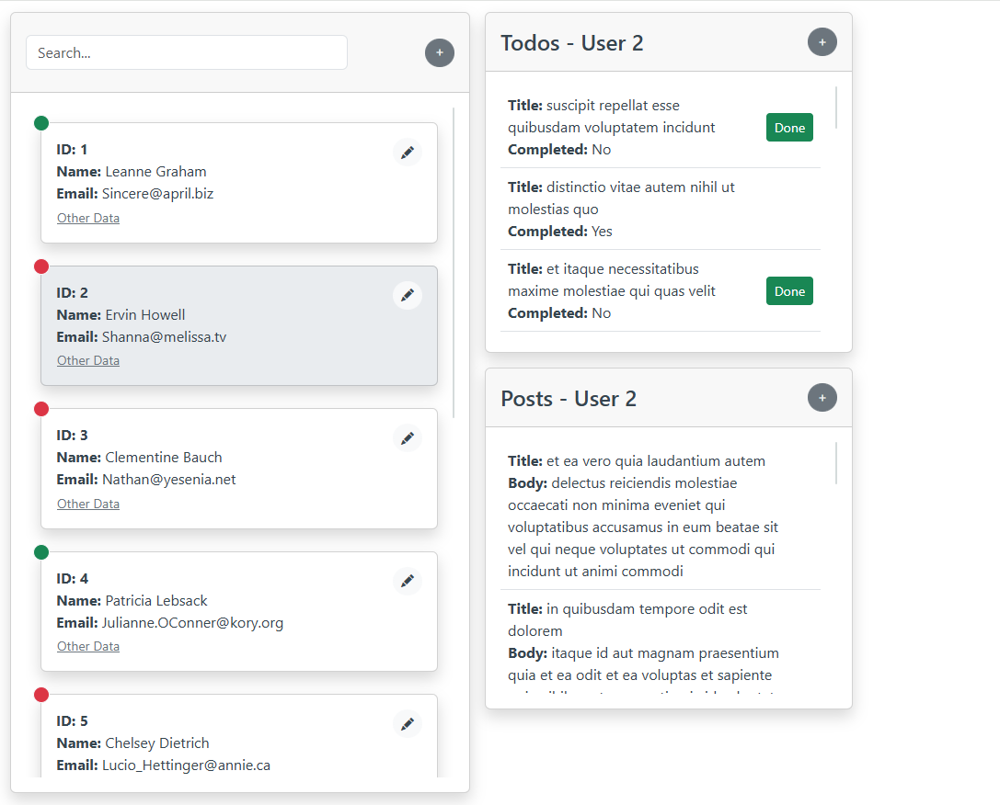

# 📌 To Do List Plus – React Application

A responsive single-page application built with React that manages users, posts, and todos using [JSONPlaceholder](https://jsonplaceholder.typicode.com/) as a mock API.  
The app includes intuitive UI, inline data manipulation, and dynamic interactions based on user actions.

---

## 🧠 Features

- User list ordered by ID
- Real-time search by name or email
- Add, edit, and delete users
- View and manage user-specific todos and posts
- Add new todos and posts with cancel option
- Mark todos as completed
- Toggle extra user data on hover

---

## 🧰 Technologies Used

- ⚛️ React with [Vite](https://vitejs.dev/)
- 📦 Axios – for API calls
- 🧮 JavaScript (ES6+)
- 🎨 CSS / Flexbox / Bootstrap
- 🌐 JSONPlaceholder

---

## 🚀 How to Run Locally

```bash
# Clone the repository
git clone https://github.com/HaimHalfon/ToDoListPlus.git

# Navigate into the project folder
cd ToDoListPlus

# Install dependencies
npm install

# Start the Vite development server
npm start
```

---

## 📷 Screenshot


